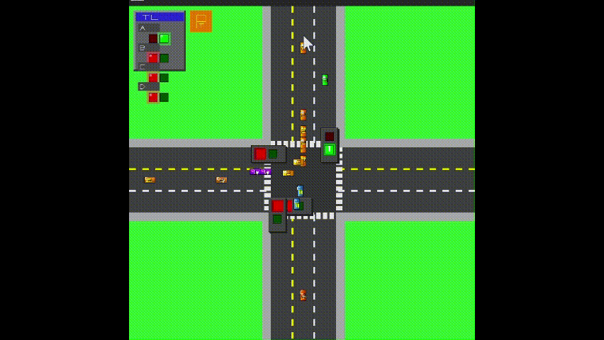

# DSA Queue Simulator - Traffic Light System

A C++/SDL3 implementation to develop a traffic light and management system to fulfil the assignment due DSA, Comp 202.
This mini project uses data structure like queue and also priority queue to manage the traffic through the lanes and traffic light management.
A comprehensive demonstration of the system's functionality and features is provided at the end of this documentation.

## 📋 Overview
This project simulates a traffic junction management system using queue data structures. It includes:
- **Priority-based vehicle queue management**
- **SDL3 graphical visualization**
- **Traffic light state management**
- **Vehicle generation system**
- **Lane prioritization logic**

## 🎑 Key Features
- **Real-time traffic simulation**
- **Priority lane handling (AL2)**
- **Normal/High-priority mode switching**
- **Vehicle queue visualization**
- **Traffic light state synchronization**
- **File-based inter-process communication**

## 🛠️ Build Instructions

### Prerequisites
- C++17 compatible compiler
- CMake 3.12+
- SDL3 library
- Git

### Build Steps
```bash
# Clone repository with submodules
git clone --recursive https://github.com/trimstrayy/Traffic-Mgmt.git
cd Traffic-Mgmt

# Create and redirect to build directory
mkdir build 
then
cd build

# Configure and build
cmake .. 
then 
cmake --build .

# Run the simulation
cd build 
cd bin
run trafficgenerator.exe && run simulator.exe

## 🎥 Simulation Display
Below is a snapshot of the traffic simulation in action:

.